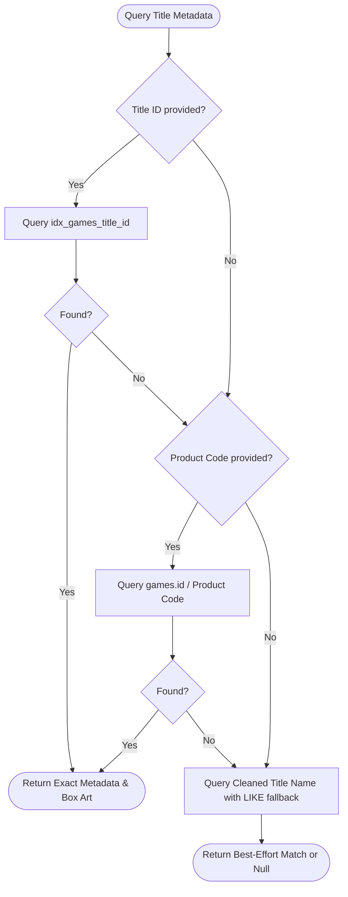

# 🎮 Metadata & Box Art Pipeline

This document details the metadata unification, offline SQLite schema, Title ID resolution precedence, and multi-tier box art CDN architecture implemented in **hShop Thor**.

---

## 1. Metadata Sources & Unification

To provide complete, offline, zero-latency metadata and high-fidelity box art on the AYN Thor dual displays, hShop Thor combines three comprehensive datasets:

1. **GameTDB (3DS Dataset)**: Rich community metadata including synopses, developers, publishers, release dates, player counts, rating badges, and regional cover scans.
2. **3DS Scene Releases Database (`3dsreleases.xml`)**: Complete release records with exact 16-character hexadecimal Title IDs (e.g. `0004000000037500`), minimum console firmware requirements (e.g. `FW 11.4.0E`), trimmed ROM byte sizes, card types, and release groups.
3. **Play-Asia Catalog (`playasia_catalog.json`)**: 1,975 catalogued physical titles contributing **1,075 new genres**, **450+ new storylines/synopses**, PAX-Codes, barcodes (UPC/EAN), and official release dates.

### Merged Dataset Statistics
* **Total Catalogued Titles**: 4,815 unique titles.
* **Indexed Title IDs**: 2,711 titles enriched with exact 16-character Title IDs.
* **Firmware Constraints**: 2,711 entries enriched with minimum system firmware.
* **Storylines / Synopses**: 4,244 titles with full descriptions (88.1% coverage).
* **Genre Classifications**: 1,976 titles classified (up from 901, +119%).
* **Official Release Dates**: 4,687 titles (97.3% coverage).
* **Tracked WebP Box Covers**: 4,292 high-resolution covers.
* **Unified Master XML**: Saved as [app/src/main/assets/3dstdb.xml](file:///home/hpnquoc/R/projects/personal_project/thor/hshop/app/src/main/assets/3dstdb.xml) (13 MB) and released on [thor-3ds-db](https://github.com/nq-910/thor-3ds-db) as `3dsdb.xml` / `3dsdb.xml.gz`.

---

## 2. Offline SQLite Architecture (`gametdb.db`)

Rather than parsing a 13 MB XML document into memory at runtime, `scripts/generate_gametdb.py` compiles the XML into a lean, highly optimized SQLite database stored at [app/src/main/assets/gametdb.db](file:///home/hpnquoc/R/projects/personal_project/thor/hshop/app/src/main/assets/gametdb.db) (~4.28 MB).

### Database Schema
```sql
CREATE TABLE games (
    id TEXT PRIMARY KEY,          -- 4-char Game ID / Product Code (e.g. CTR-P-EKJA / EKJA)
    title_id TEXT,               -- 16-character hex Title ID (e.g. 0004000000055D00)
    name TEXT NOT NULL,          -- Full Release / Scene Name
    title TEXT NOT NULL,         -- Clean Canonical Title
    synopsis TEXT,               -- Extended game description / storyline
    developer TEXT,              -- Developer studio
    publisher TEXT,              -- Publishing entity
    release_date TEXT,           -- Normalized release date (YYYY-MM-DD)
    genre TEXT,                  -- Comma-separated genres
    rating_type TEXT,            -- CERO, ESRB, PEGI, etc.
    rating_val TEXT,             -- Rating age / classification
    rating_desc TEXT,            -- Content advisory descriptors
    players TEXT,                -- Supported player count
    wifi_features TEXT,          -- Online multiplayer / StreetPass features
    languages TEXT,              -- Supported language codes
    region TEXT,                 -- Regional release code (USA, EUR, JPN)
    firmware TEXT,               -- Minimum firmware requirement (e.g. 6.1.0E)
    trimmed_size INTEGER,        -- Exact trimmed ROM size in bytes
    card TEXT                    -- Card type / cartridge generation
);

CREATE INDEX idx_games_title_id ON games(title_id);
CREATE INDEX idx_games_title ON games(title COLLATE NOCASE);
CREATE INDEX idx_games_name ON games(name COLLATE NOCASE);
```

### Resolution Precedence (`GameTdbRepository.kt`)
When a title is selected in the catalog or library, metadata resolution follows a strict 3-tier precedence hierarchy:



1. **Exact Title ID Lookup (`title_id`)**: Completely unambiguous. Avoids regional product code mismatches and identical game names across platforms.
2. **Product Code Lookup (`id`)**: Fallback matching `CTR-P-XXXX`, `CTR-N-XXXX`, or 4-character disc IDs.
3. **Normalized Title Search (`title` / `name`)**: Strips region tags (`(USA)`, `[EUR]`, `(En,Ja)`), edition suffixes, and punctuation for resilient fallback matching.

---

## 3. Multi-Tier Box Art CDN Pipeline

Cover artwork resolution is managed by `ArtworkResolver.kt` in `core-scraper`. To ensure zero broken images and low bandwidth consumption, artwork is fetched across a tiered fallback ladder prioritizing our global WebP CDN:

```
[Level 1: Local Disk Cache]
    └── Coil Disk Cache (256 MB in cacheDir/image_cache)
[Level 2: High-Speed WebP CDN (Primary)]
    └── https://cdn.jsdelivr.net/gh/nq-910/thor-3ds-db@main/covers/{gameId}.webp
[Level 3: Primary GameTDB Regional Scans (Fallback)]
    └── https://art.gametdb.com/3ds/cover/{region}/{gameId}.jpg
[Level 4: GameTDB High-Res Scans (Fallback)]
    └── https://art.gametdb.com/3ds/coverHQ/{region}/{gameId}.jpg
[Level 5: Libretro Boxart Database (Fallback)]
    └── Libretro Thumbnail Scans
```

### The `thor-3ds-db` Repository
Hosted at [https://github.com/nq-910/thor-3ds-db](https://github.com/nq-910/thor-3ds-db), this companion repository provides:
* **4,292 Optimized WebP Covers**: High-resolution covers losslessly compressed to ~50 KB each (down from 300+ KB JPEGs).
* **Global jsDelivr Edge Distribution**: Instant worldwide CDN loading with automatic Brotli/HTTP3 delivery.
* **Automated CI/CD Verification**: GitHub Actions workflow validates SQLite integrity, builds compressed XML `.gz` artifacts, and produces GitHub Releases automatically.

---

## 4. Dual-Screen Presentation Details

On the AYN Thor's top display (`1080x1920` scaled), the metadata is displayed via `TopScreenContent.kt`:
* **Dynamic Header Typography**: Automatically downscales title font size (`26sp` ➔ `23sp` ➔ `20sp`) for verbose localization titles (e.g. *Pokémon Mystery Dungeon: Gates to Infinity*).
* **Responsive Chip Flow**: `FlowRow` renders compact badges for:
  - Developer & Publisher (with `maxLines = 1` and `TextOverflow.Ellipsis`).
  - Release Date (`YYYY-MM-DD`).
  - Supported Player Count.
  - **Firmware Requirement Badge** (`FW <version>`, highlighted in primary accent).
* **Synopsis Modal**: Gamepads trigger synopsis expansion via **Button X**; users can read multi-paragraph local descriptions with full gamepad stick scrolling.
