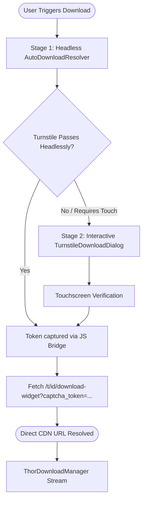

# 🌐 Turnstile & Download Pipeline

## Overview
hShop protects its download endpoints using **Cloudflare Turnstile** anti-bot verification. Because Turnstile executes client-side WebGL/Canvas fingerprinting and telemetry that rejects Python-based scraping tools (such as `cloudscraper` or `requests`), **hShop Thor** utilizes a native Android Chromium WebView execution engine to obtain direct, high-speed CDN URLs seamlessly.

---

## 1. Dual-Stage Turnstile Resolution

hShop Thor handles Cloudflare challenges using a progressive 2-stage resolver architecture:



### Stage 1: Headless Resolver (`AutoDownloadResolver.kt`)
* Instantiates an invisible background Android `WebView` configured with real device user agent and third-party cookie support.
* Injects a lightweight JavaScript hook intercepting `window.submitCaptcha(token)` and `fetch()` requests to `download-widget`.
* Over 90% of requests pass automatically in the background within 1–3 seconds without interrupting the user.

### Stage 2: Interactive Modal Fallback (`TurnstileDownloadDialog.kt`)
* If Cloudflare requires explicit user interaction or suspicious network verification, a clean, isolated modal dialog appears.
* Injected CSS strips all extraneous web layout (headers, footers, donation banners, tables), isolating only the Turnstile widget on a dark slate `#14171C` background.
* Once completed, the download link is captured immediately, the dialog auto-dismisses, and queuing begins.

---

## 2. Why Cloudflare Turnstile Rejects Bot Solvers

Tools like `cloudscraper` or HTTP clients fail on hShop's download endpoints with **HTTP 403 Forbidden**:
1. **Title Page**: `https://hshop.erista.me/t/{id}` embeds `challenges.cloudflare.com/turnstile/v0/api.js`.
2. **Download Widget**: `https://hshop.erista.me/t/{id}/download-widget` strictly validates a one-time cryptographic `captcha_token` against Cloudflare's backend API (`siteverify`).
3. **Hardware-Level Fingerprinting**: Turnstile requires a real browser engine executing JavaScript, canvas operations, and TLS client-hello profiles. Android's official Chromium WebView provides the required genuine environment natively.

---

## 3. Download Execution Flow & Lifecycle

```
1. User requests download of Title (e.g. 0004000000055D00)
                    │
                    ▼
2. Resolution Pipeline (AutoDownloadResolver ➔ TurnstileDownloadDialog)
   - CookieManager enables 3rd-party cookies.
   - Captured token passes to /download-widget.
                    │
                    ▼
3. Direct CDN URL extracted: https://download4.erista.me/content/{id}?token=...
                    │
                    ▼
4. Pre-Flight Storage Check: verifies usable disk space >= (size + 50 MB margin).
                    │
                    ▼
5. ThorDownloadManager streams chunked bytes to /sdcard/ROMs/3DS/Game.cia.download
                    │
                    ▼
6. Verification & Atomic Promotion:
   - Checksum / byte count validation.
   - Atomic rename: Game.cia.download ➔ Game.cia.
                    │
                    ▼
7. Automated Post-Processing:
   - If autoConvertTo3ds: triggers native libcia3ds decryption (CIA ➔ CCI).
   - If autoCompressToZcci: converts CCI ➔ seekable .zcci archive.
   - If autoRemoveDownloadedCia: cleans up intermediate files to reclaim space.
```

---

## 4. Download State Machine (`DownloadStatus`)

```
[QUEUED] ➔ [CONNECTING] ➔ [DOWNLOADING] ➔ [CONVERTING] ➔ [COMPLETED]
    │             │              │               │
    └─────────────┴──────────────┴───────────────┴──➔ [FAILED] / [CANCELLED]
```

* Active state is managed via Kotlin coroutines and `StateFlow`, displaying live percentage, transfer speed (MB/s), and estimated time remaining (ETA) across both Thor screens.
